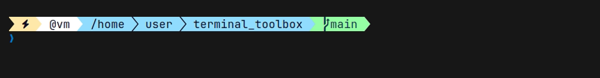
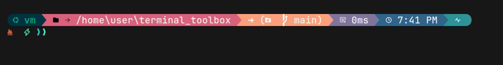

# terminal-setup

One-stop scripts to provision a terminal with zsh (or PowerShell), a Nerd
Font, [Oh My Zsh](https://ohmyz.sh), [Oh My Posh](https://ohmyposh.dev),
[lsd](https://github.com/lsd-rs/lsd), [bat](https://github.com/sharkdp/bat),
[fzf](https://github.com/junegunn/fzf), [zoxide](https://github.com/ajeetdsouza/zoxide),
[tmux](https://github.com/tmux/tmux), and [Superfile](https://superfile.dev).

Run one interactively and it opens with a picker — 10 Nerd Fonts, 7 themes
(Dracula, Catppuccin, JanDeDobbeleer, Paradox, Aliens, Montys, Unicorn) —
before anything installs. Piped/CI runs skip the prompt and keep the
Dracula + JetBrainsMono defaults.

> Screenshots below are real captures, not mockups: taken by actually running
> `scripts/setup-ubuntu.sh` end-to-end, then recording the resulting shell
> with [VHS](https://github.com/charmbracelet/vhs) — same Dracula
> `dracula.omp.json`/`dracula.toml` configs this repo installs, plus the
> official [dracula/lsd](https://github.com/dracula/lsd) `colors.yaml` for
> the `lsd` shot. What you see is what you get.

## Usage

Clone the repo and run the script for your platform, or install directly
with the one-liner below (uses process substitution / `iex`, not a plain
pipe, so the interactive font/theme picker still works — a straight
`curl | bash` pipe would consume stdin with the script itself and silently
force the non-interactive defaults).

**Ubuntu / Debian / Raspberry Pi OS**
```
bash scripts/setup-ubuntu.sh
```
```
bash <(curl -fsSL https://raw.githubusercontent.com/defsix/terminal_toolbox/main/scripts/setup-ubuntu.sh)
```

**Termux (Android)**
```
bash scripts/setup-termux.sh
```
```
bash <(curl -fsSL https://raw.githubusercontent.com/defsix/terminal_toolbox/main/scripts/setup-termux.sh)
```

**Windows (PowerShell, run as Administrator)**
```powershell
Set-ExecutionPolicy Bypass -Scope Process -Force
.\scripts\setup-windows.ps1
```
```powershell
Set-ExecutionPolicy Bypass -Scope Process -Force; iex (irm https://raw.githubusercontent.com/defsix/terminal_toolbox/main/scripts/setup-windows.ps1)
```
That `-Scope Process` bypass only covers this one run — the script itself
permanently sets your user's execution policy to `RemoteSigned` near the
end (no admin needed for that part), so `$PROFILE` actually loads the next
time you open PowerShell instead of failing with "running scripts is
disabled on this system."

All scripts are idempotent — safe to re-run after a partial failure or to
pick up changes.

## What you get

- zsh + **Oh My Zsh**, with the `zsh-autosuggestions` and
  `zsh-syntax-highlighting` plugins enabled alongside the default `git`
  plugin (PowerShell profile on Windows, since zsh isn't native there)
- An interactive picker — run the script from a real terminal and it asks
  for your Nerd Font and theme before installing anything; piped/CI runs
  keep the JetBrainsMono + Dracula defaults. Rerun anytime to switch: the
  script replaces its managed config instead of duplicating it.
- 10 Nerd Fonts to choose from: JetBrainsMono, FiraCode, CascadiaCode, Hack,
  Meslo, SourceCodePro, Iosevka, UbuntuMono, RobotoMono, Inconsolata
- 7 themes, applied consistently across every tool below: Dracula,
  Catppuccin, JanDeDobbeleer, Paradox, Aliens, Montys, Unicorn — all real
  premade oh-my-posh prompts with genuine powerline color-bar segments,
  not palette knockoffs
- Oh My Posh drawing the prompt (Oh My Zsh's own theme is disabled so the
  two don't fight over the prompt)
- lsd as a drop-in `ls` replacement (`ll`, `la`, `lt` aliases included)
- bat (`cat` replacement), aliased over `cat`
- fzf, fuzzy search wired into Oh My Zsh (history search, file/completion
  widgets) via its bundled `fzf` plugin, themed via `FZF_DEFAULT_OPTS`
- zoxide, a learning `cd` — `z`/`zi` jump to frecently-used directories
- tmux, themed status bar (Linux/Termux only — no native Windows port; use WSL)
- Superfile (`spf`), themed to match

## Themes

Real captures of the Oh My Posh prompt in each theme — same repo, same
directory, only the `--config` file changed. Every theme here is a genuine
premade upstream oh-my-posh theme (its own segment layout, its own colors)
— none of these are palette knockoffs recolored onto someone else's
template, so each one looks meaningfully different, not just retinted.

| | |
|---|---|
| **Dracula**<br> | **Catppuccin**<br> |
| **JanDeDobbeleer**<br> | **Paradox**<br> |
| **Aliens**<br> | **Montys**<br> |
| **Unicorn**<br> | |

bat/lsd/tmux/Superfile colors for each theme are derived from that same
prompt's own segment colors, so the whole terminal matches whichever one
you pick — not just the prompt line.

## Walkthrough

1. **Run the script for your platform** (see [Usage](#usage)). From a real
   terminal it asks you to pick a Nerd Font and a theme first — press Enter
   at either prompt to keep the default (JetBrainsMono / Dracula). Each
   install step then prints `=== n/10: ... ===` as it goes, and prints
   `already installed, skipping` for anything a previous run already
   handled.

2. **Prompt.** Once it's done, restart your shell (`exec zsh`, or log
   out/in). Oh My Posh draws the prompt — directory, git branch, shell,
   clock — in your chosen theme, on top of Oh My Zsh's `zsh-autosuggestions`
   (ghost-text completions from history) and `zsh-syntax-highlighting`
   (a command turns green once it resolves to something real, red if it
   doesn't). Screenshots below are from a Dracula run — the other 6 themes
   recolor the same prompt/icons/status bar, not a different layout:

   
   *Top to bottom: a valid command in green, a typo (`gti`) in red, and
   `atus` shown as a greyed-out autosuggestion after typing `git st`.*

3. **File listing.** `ls`/`ll`/`la`/`lt` now resolve to `lsd`, which adds
   icons and per-file-type coloring — shown here with the official
   [dracula/lsd](https://github.com/dracula/lsd) `colors.yaml`:

   

4. **bat / fzf / zoxide.** `cat` resolves to `bat` in your chosen theme,
   `Ctrl+R`/tab completion get fzf's fuzzy picker (same palette via
   `FZF_DEFAULT_OPTS`, wired in through Oh My Zsh's own `fzf` plugin so it
   finds the right integration files regardless of platform), and
   `z <partial-name>` jumps to a frecently-used directory via zoxide.

5. **tmux.** Start a session with `tmux` — the status bar comes up themed
   immediately, no `prefix + I` plugin-manager step needed. Dracula uses the
   official [dracula/tmux](https://github.com/dracula/tmux) plugin (cloned
   in directly by the script); the other 6 themes use a compact hand-colored
   status bar built from that theme's own palette, since not every theme has
   a maintained standalone (non-TPM) tmux port:

   

6. **Superfile.** Launch the TUI file manager with `spf` — it opens with
   your chosen theme already set in its `config.toml`:

   

7. **Re-running is safe.** Every step is guarded by an existence check
   (directory, binary, or config line), so re-running after a failed step,
   or to pick up a new version of the script, only does the work that's
   still missing.

See `CLAUDE.md` for implementation notes and known platform quirks.

## Changelog

### 2026-07-29
**Oh My Zsh / shell setup**
- Enabled the `zsh-autosuggestions` and `zsh-syntax-highlighting` plugins and
  disabled Oh My Zsh's own `ZSH_THEME` (Oh My Posh draws the prompt instead).
- **Fixed:** on a machine that already has a `.zshrc`, Oh My Zsh's installer
  (`KEEP_ZSHRC=yes`) leaves it untouched and never sources `oh-my-zsh.sh`,
  silently no-op'ing the plugin patches above. Both scripts now detect this
  and bootstrap Oh My Zsh into the existing `.zshrc` themselves.

**Reliability fixes** (all found by actually dogfooding each script
end-to-end, not just reading the code)
- Superfile's `spf path-list` stopped initializing config as of v1.6.0 (it
  only prints paths now) — switched to `spf --fix-config-file`.
- `setup-windows.ps1`'s profile step silently did nothing on a fresh
  machine: `Get-Content -Raw` on a brand-new `$PROFILE` returns `$null`,
  and `$null -notmatch <pattern>` is a falsy empty array, not `$true`.
- `setup-termux.sh`'s only Superfile install path was 100% broken — the
  release tarball nests the binary under `dist/<name>/spf`, not at the top
  level. Its oh-my-posh Android fallback also 404'd on `posh-android-arm64`
  (doesn't exist; oh-my-posh ships exactly one Android build,
  `posh-android-arm`) — on the most common real Android architecture,
  combined with `set -e`, this silently killed the rest of the script.
- Unauthenticated `api.github.com` release lookups (Superfile on Termux,
  lsd's .deb fallback on Ubuntu) had no error handling — a rate limit or
  network hiccup left an empty tag var and, via `set -e`, silently killed
  the rest of the script. Now checked explicitly with a clear message.
- `setup-ubuntu.sh` piped the oh-my-posh/Superfile installers straight into
  `bash` with no error handling — a failed fetch either silently "succeeds"
  at installing nothing (empty script, exit 0) or, worse, executes a
  proxy's rejection body as shell commands. Now downloads to a file, checks
  it explicitly, then runs it.
- Final cross-platform re-verification after the above landed found and
  removed one leftover: a dead `alias spf='spf'` in `setup-ubuntu.sh`.

**Tooling and theme system** (bat, fzf, zoxide, tmux, then the interactive
picker, then two rounds of theme-quality fixes)
- Added bat, fzf, zoxide, and tmux (Linux/Termux only for tmux) to all
  three scripts, Dracula-themed initially. fzf is wired in through Oh My
  Zsh's bundled `fzf` plugin rather than hand-rolling per-distro
  shell-integration detection.
- Added an interactive Nerd Font + theme picker (`[ -t 0 ]` / `IsInputRedirected`
  gated, so piped/CI runs keep the JetBrainsMono + Dracula defaults) with a
  strip-and-reappend mechanism so switching themes replaces the managed
  config block instead of duplicating it.
- **Found and fixed a real lsd bug:** Debian/Ubuntu's apt-packaged lsd
  (1.0.0) only honors *numeric* xterm-256 color indices in `colors.yaml` —
  it silently ignores the hex format both `dracula/lsd` and `catppuccin/lsd`
  publish upstream (confirmed by A/B testing). lsd theming had actually
  never been wired up by this repo before this pass at all. Fixed by
  generating real `config.yaml`/`colors.yaml` files with precomputed
  nearest-match numeric values for every theme except Dracula (whose
  official file is already numeric).
- The theme roster went through two correction passes once real screenshots
  were compared against the target look:
  1. Oh-my-posh's official per-flavor Catppuccin files
     (`catppuccin_mocha`/`_macchiato`/`_frappe`/`_latte`) all use flat
     `"style": "plain"` — no color-bar segments at all. Switched to
     `catppuccin.omp.json`, the one official "core" theme that actually
     uses powerline/diamond segments (hardcodes the Macchiato palette, so
     bat/lsd/superfile/tmux match Macchiato too). 10 themes → 7.
  2. Gruvbox/Nord/Tokyo Night/Rose Pine/Everforest then came back looking
     muddy and too similar to each other — turned out to be structural,
     not a color-picking mistake: those palettes are all, by design
     philosophy, muted/pastel, and (confirmed by cloning oh-my-posh's full
     122-file themes directory) no Nord/Rose Pine/Everforest theme exists
     upstream at all. Replaced all 5 with genuine vibrant premade themes
     instead (JanDeDobbeleer, Paradox, Aliens, Montys, Unicorn), deriving
     bat/lsd/tmux/Superfile colors from each one's own segment colors.
  - **Discovered along the way:** Superfile supports fully custom theme
    files, not just its bundled names
    (https://superfile.dev/configure/custom-theme/) — every theme now gets
    its own generated `~/.config/superfile/theme/<theme>.toml` from its own
    role colors, instead of guessing the closest bundled name.
  - **Testing note:** driving `setup-windows.ps1`'s picker outside real
    Windows needs a PTY fix — PSReadLine blocks `Read-Host` on a
    cursor-position query (`ESC[6n`) that a plain pseudo-tty never answers.
    The test driver answers it (`ESC[1;1R`); a real terminal does this
    itself, so it's a test-harness requirement, not a script issue.
  - Each stage verified end-to-end on all three platforms: fresh install,
    an interactive-picker theme switch, and idempotency (no duplicated
    config on a same-theme rerun).
- Replaced the placeholder screenshots under `docs/screenshots/` with real
  [VHS](https://github.com/charmbracelet/vhs) captures throughout, including
  a small prompt screenshot per theme in the [Themes](#themes) section
  above — actually run, actually recorded, not mockups.
- Added the one-line curl-install commands in [Usage](#usage) (process
  substitution / `iex`, not a plain pipe, so the interactive picker still
  works over a piped install).
- **Fixed (found via a real Windows run):** `setup-windows.ps1` only ever
  set `Set-ExecutionPolicy Bypass -Scope Process -Force`, which covers just
  the one session running the installer — it never persists, so every
  *new* PowerShell window still hit Windows' default `Restricted` policy
  and refused to load `$PROFILE` at all (`UnauthorizedAccess`/
  `PSSecurityException`), silently leaving oh-my-posh/lsd/aliases dead even
  though the install itself succeeded. The script now also sets
  `RemoteSigned` at `CurrentUser` scope near the end (no admin rights
  needed for that scope, unlike `LocalMachine`) so `$PROFILE` loads in
  future sessions too — skipped automatically if the user's policy already
  permits local scripts.
- **Fixed (found via the same real Windows run):** all three scripts'
  Superfile step called `spf --fix-config-file` to generate a default
  `config.toml` on first install. That call opens the real controlling
  terminal directly (`/dev/tty` on Linux, the equivalent on Windows) rather
  than respecting redirected stdin/stdout, so on an actual interactive
  terminal — the normal way anyone runs this script — it launched the full
  Superfile TUI and hung there instead of writing the config and exiting.
  The theme still got set correctly on non-interactive test runs (which
  genuinely have no tty at all and hit the fast, documented "exits because
  there's no TTY" path), which is exactly why this hadn't been caught
  before. Fixed by no longer calling `spf --fix-config-file` at all: if
  `config.toml` doesn't exist, the scripts now write a minimal one
  themselves with just the `theme = "..."` line — Superfile fills in every
  other field with its own built-in default, so this is sufficient with no
  console risk. Reproduced and confirmed fixed with a PTY test harness that
  properly separates the simulated terminal session from the script
  process (a single self-`setsid`'d test process doesn't reproduce it).
- **Fixed (found via a real device that had oh-my-posh break after a
  Termux backup restore):** `setup-termux.sh` only checked that
  `oh-my-posh` existed on PATH before deciding to skip installing it —
  not that it actually ran. A binary can be present but non-functional
  (Android's linker rejecting a non-PIE ELF with "has unexpected e_type:
  2" is one real way this happens, notably after restoring `$PREFIX` from
  a Termux backup taken on a different install/build — Play Store,
  F-Droid, and GitHub builds aren't guaranteed binary-compatible with each
  other). Once that happened, the script would report "already installed,
  skipping" forever after, with no way to recover short of deleting the
  file by hand. Fixed by verifying `oh-my-posh --version` actually
  succeeds before treating it as installed; if not, the broken file is
  removed first (an untracked file at that path can otherwise make `pkg
  install` fail trying to overwrite it), reinstalled, and — verified again
  — falls through to the GitHub binary if still broken or unavailable, so
  a still-non-functional fetch gets cleaned up instead of left in place.
  Verified with a simulated broken binary (a non-executable stub) as well
  as the normal already-working case (confirms no unnecessary reinstalls).
