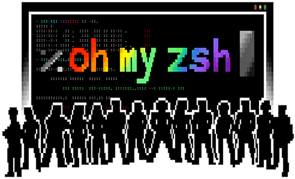
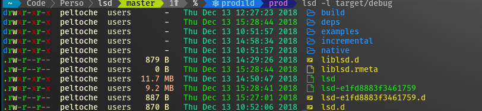
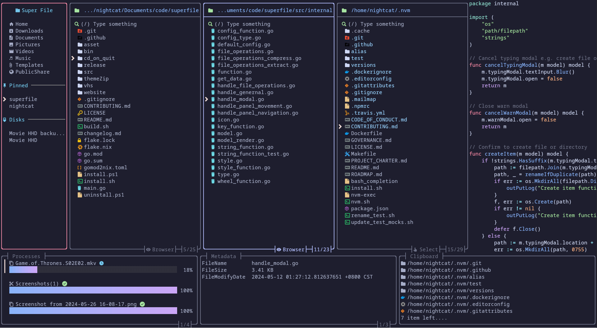

# terminal-setup

One-stop scripts to provision a terminal with zsh (or PowerShell), a Nerd
Font, [Oh My Zsh](https://ohmyz.sh), [Oh My Posh](https://ohmyposh.dev),
[lsd](https://github.com/lsd-rs/lsd), and [Superfile](https://superfile.dev)
— themed in Dracula throughout.

> Screenshots below are each tool's own official demo image, pulled from its
> GitHub repo (credited under each one) — they show that project's own demo
> theme, not necessarily the Dracula colors you'll get after running these
> scripts. For an exact live preview of the Dracula theme specifically, see
> the [Oh My Posh themes page](https://ohmyposh.dev/docs/themes#dracula).

## Usage

**Ubuntu / Debian / Raspberry Pi OS**
```
bash scripts/setup-ubuntu.sh
```

**Termux (Android)**
```
bash scripts/setup-termux.sh
```

**Windows (PowerShell, run as Administrator)**
```powershell
Set-ExecutionPolicy Bypass -Scope Process -Force
.\scripts\setup-windows.ps1
```

All scripts are idempotent — safe to re-run after a partial failure or to
pick up changes.

## What you get

- zsh + **Oh My Zsh**, with the `zsh-autosuggestions` and
  `zsh-syntax-highlighting` plugins enabled alongside the default `git`
  plugin (PowerShell profile on Windows, since zsh isn't native there)
- A Nerd Font (JetBrainsMono by default — edit the variable at the top of
  each script to change it)
- Oh My Posh, Dracula theme, drawing the prompt (Oh My Zsh's own theme is
  disabled so the two don't fight over the prompt)
- lsd as a drop-in `ls` replacement (`ll`, `la`, `lt` aliases included)
- Superfile (`spf`), Dracula theme

## Walkthrough

1. **Run the script for your platform** (see [Usage](#usage)). Each step
   prints `=== n/6: ... ===` as it goes, and prints `already installed,
   skipping` for anything a previous run already handled.

   
   *Oh My Zsh, installed with the `git`, `zsh-autosuggestions`, and
   `zsh-syntax-highlighting` plugins enabled.
   Source: [ohmyzsh/ohmyzsh](https://github.com/ohmyzsh/ohmyzsh).*

2. **Prompt.** Once it's done, restart your shell (`exec zsh`, or log
   out/in). Oh My Posh draws the prompt — segments for context (directory,
   git branch, shell, exit status, clock) — on top of Oh My Zsh's
   autosuggestions and syntax highlighting; the script points it at the
   Dracula theme instead of the default shown here:

   
   *Source: [JanDeDobbeleer/oh-my-posh](https://github.com/JanDeDobbeleer/oh-my-posh)
   (`website/static/img/hero.png`).*

3. **File listing.** `ls`/`ll`/`la`/`lt` now resolve to `lsd`, which adds
   icons and per-file-type coloring:

   
   *Source: [lsd-rs/lsd](https://github.com/lsd-rs/lsd) (`assets/screen_lsd.png`).*

4. **Superfile.** Launch the TUI file manager with `spf` — it opens with
   the `dracula` theme already set in its `config.toml`:

   
   *Source: [yorukot/superfile](https://github.com/yorukot/superfile)
   (`website/src/assets/demo.png`).*

5. **Re-running is safe.** Every step is guarded by an existence check
   (directory, binary, or config line), so re-running after a failed step,
   or to pick up a new version of the script, only does the work that's
   still missing.

See `CLAUDE.md` for implementation notes and known platform quirks.

## Changelog

### 2026-07-29
- Enabled `zsh-autosuggestions` and `zsh-syntax-highlighting` as Oh My Zsh
  plugins on Ubuntu and Termux (previously Oh My Zsh was installed but left
  on its stock config with no extra plugins).
- Disabled Oh My Zsh's own `ZSH_THEME` on install so it no longer loads a
  theme that Oh My Posh immediately overwrites.
- Added this Walkthrough section and this Changelog.
- Added real screenshots under `docs/screenshots/`, pulled from each
  project's own GitHub repo (Oh My Zsh, Oh My Posh, lsd, Superfile) and
  credited inline — replacing an earlier draft that used hand-drawn
  Dracula-palette mockups instead.
