# terminal-setup

One-stop scripts to provision a terminal with zsh (or PowerShell), a Nerd
Font, [Oh My Zsh](https://ohmyz.sh), [Oh My Posh](https://ohmyposh.dev),
[lsd](https://github.com/lsd-rs/lsd), [bat](https://github.com/sharkdp/bat),
[fzf](https://github.com/junegunn/fzf), [zoxide](https://github.com/ajeetdsouza/zoxide),
[tmux](https://github.com/tmux/tmux), [Superfile](https://superfile.dev), and a
system-info fetch tool — [nerdfetch](https://github.com/ThatOneCalculator/NerdFetch)
on Linux/Termux, [fastfetch](https://github.com/fastfetch-cli/fastfetch) on
Windows (nerdfetch doesn't support Windows at all).

Run one interactively and it opens with a picker — 10 Nerd Fonts, 8 themes
(Dracula, M365Princess, Atomic, Catppuccin, Catppuccin Mocha, JanDeDobbeleer,
Marcduiker, Neko) — before anything installs. Piped/CI runs skip the prompt
and keep the Dracula + JetBrainsMono defaults.

> Screenshots below are real captures, not mockups: taken by actually running
> `scripts/setup-ubuntu.sh` end-to-end, then recording the resulting shell
> with [VHS](https://github.com/charmbracelet/vhs) — same Dracula
> `dracula.omp.json`/`dracula.toml` configs this repo installs, plus the
> official [dracula/lsd](https://github.com/dracula/lsd) `colors.yaml` for
> the `lsd` shot. What you see is what you get.

## Usage

Clone the repo and run the script for your platform, or install directly
with the one-liner below (uses process substitution / `iex`, not a plain
pipe, so the interactive font/theme picker still works — a straight
`curl | bash` pipe would consume stdin with the script itself and silently
force the non-interactive defaults).

**Ubuntu / Debian / Raspberry Pi OS**
```
bash scripts/setup-ubuntu.sh
```
```
bash <(curl -fsSL https://raw.githubusercontent.com/defsix/terminal_toolbox/main/scripts/setup-ubuntu.sh)
```

**CachyOS (Arch Linux-based)**
```
bash scripts/setup-cachyos.sh
```
CachyOS defaults to fish, not bash — fish doesn't understand `<(...)`
process substitution at all (it fails immediately with "Invalid
redirection target"), so the one-liner needs fish's own equivalent,
`psub`, instead:
```fish
bash (curl -fsSL https://raw.githubusercontent.com/defsix/terminal_toolbox/main/scripts/setup-cachyos.sh | psub)
```
If you're already in bash/zsh (e.g. over SSH with a forced shell, or after
`chsh`), the same form as Ubuntu above works too:
```
bash <(curl -fsSL https://raw.githubusercontent.com/defsix/terminal_toolbox/main/scripts/setup-cachyos.sh)
```

**Termux (Android)**
```
bash scripts/setup-termux.sh
```
```
bash <(curl -fsSL https://raw.githubusercontent.com/defsix/terminal_toolbox/main/scripts/setup-termux.sh)
```

**Windows (PowerShell, run as Administrator)**
```powershell
Set-ExecutionPolicy Bypass -Scope Process -Force
.\scripts\setup-windows.ps1
```
```powershell
Set-ExecutionPolicy Bypass -Scope Process -Force; iex (irm https://raw.githubusercontent.com/defsix/terminal_toolbox/main/scripts/setup-windows.ps1)
```
That `-Scope Process` bypass only covers this one run — the script itself
permanently sets your user's execution policy to `RemoteSigned` near the
end (no admin needed for that part), so `$PROFILE` actually loads the next
time you open PowerShell instead of failing with "running scripts is
disabled on this system."

All scripts are idempotent — safe to re-run after a partial failure or to
pick up changes.

## What you get

- zsh + **Oh My Zsh**, with the `zsh-autosuggestions` and
  `zsh-syntax-highlighting` plugins enabled alongside the default `git`
  plugin (PowerShell profile on Windows, since zsh isn't native there)
- An interactive picker — run the script from a real terminal and it asks
  for your Nerd Font and theme before installing anything; piped/CI runs
  keep the JetBrainsMono + Dracula defaults. Rerun anytime to switch: the
  script replaces its managed config instead of duplicating it.
- 10 Nerd Fonts to choose from: JetBrainsMono, FiraCode, CascadiaCode, Hack,
  Meslo, SourceCodePro, Iosevka, UbuntuMono, RobotoMono, Inconsolata
- 8 themes, applied consistently across every tool below: Dracula,
  M365Princess, Atomic, Catppuccin, Catppuccin Mocha, JanDeDobbeleer,
  Marcduiker, Neko — all real premade oh-my-posh prompts fetched
  unmodified from upstream, not palette knockoffs
- Oh My Posh drawing the prompt (Oh My Zsh's own theme is disabled so the
  two don't fight over the prompt)
- lsd as a drop-in `ls` replacement (`ll`, `la`, `lt` aliases included)
- bat (`cat` replacement), aliased over `cat`
- fzf, fuzzy search wired into Oh My Zsh (history search, file/completion
  widgets) via its bundled `fzf` plugin, themed via `FZF_DEFAULT_OPTS`
- zoxide, a learning `cd` — `z`/`zi` jump to frecently-used directories
- tmux, themed status bar (Linux/Termux only — no native Windows port; use WSL)
- Superfile (`spf`), themed to match
- A system-info fetch tool runs automatically at the end of a new shell:
  [nerdfetch](https://github.com/ThatOneCalculator/NerdFetch) on
  Linux/Termux (it doesn't support Windows at all, even under Git Bash),
  [fastfetch](https://github.com/fastfetch-cli/fastfetch) on Windows
  instead. Either script comments out (never deletes) a pre-existing
  fastfetch/neofetch invocation it finds in your shell config, so it
  doesn't fight with the new one for stdout on every prompt.

## Themes

Real captures of the Oh My Posh prompt in each theme — same repo, same
directory, only the `--config` file changed. Every theme here is a genuine
premade upstream oh-my-posh theme fetched as-is, unmodified, straight from
[JanDeDobbeleer/oh-my-posh](https://github.com/JanDeDobbeleer/oh-my-posh/tree/main/themes)
— none of these are palette knockoffs recolored onto someone else's
template, so each one looks meaningfully different, not just retinted. That
also means the pill/powerline segment look isn't universal: Catppuccin
Mocha and Neko are just as genuine upstream, unmodified — they're flat
plain-text prompts by design, and this repo doesn't force a pill style onto
themes that were never built with one.

| | |
|---|---|
| **Dracula**<br>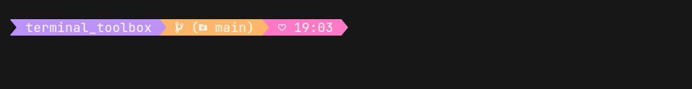 | **M365Princess**<br>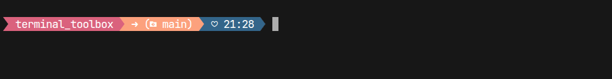 |
| **Atomic**<br>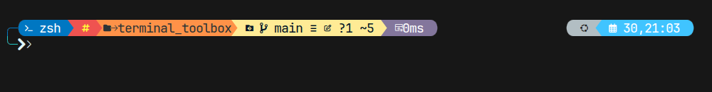 | **Catppuccin**<br> |
| **Catppuccin Mocha**<br>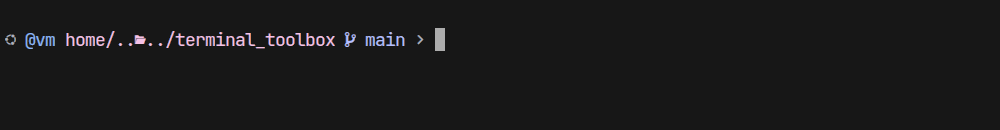 | **JanDeDobbeleer**<br>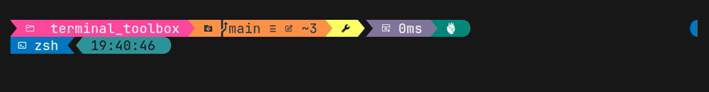 |
| **Marcduiker**<br>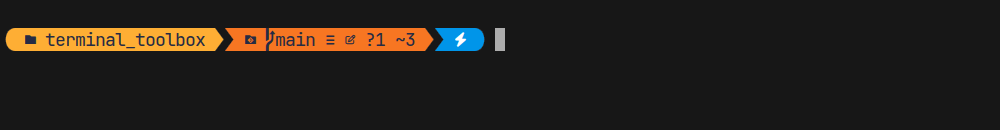 | **Neko**<br>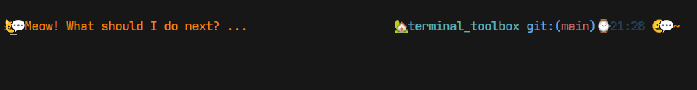 |

bat/lsd/tmux/Superfile colors for each theme are derived from that same
prompt's own segment colors, so the whole terminal matches whichever one
you pick — not just the prompt line.

## Walkthrough

1. **Run the script for your platform** (see [Usage](#usage)). From a real
   terminal it asks you to pick a Nerd Font and a theme first — press Enter
   at either prompt to keep the default (JetBrainsMono / Dracula). Each
   install step then prints `=== n/10: ... ===` as it goes, and prints
   `already installed, skipping` for anything a previous run already
   handled.

2. **Prompt.** Once it's done, restart your shell (`exec zsh`, or log
   out/in). Oh My Posh draws the prompt — directory, git branch, shell,
   clock — in your chosen theme, on top of Oh My Zsh's `zsh-autosuggestions`
   (ghost-text completions from history) and `zsh-syntax-highlighting`
   (a command turns green once it resolves to something real, red if it
   doesn't). Screenshots below are from a Dracula run — the other 6 themes
   recolor the same prompt/icons/status bar, not a different layout:

   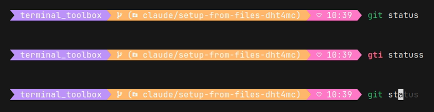
   *Top to bottom: a valid command in green, a typo (`gti`) in red, and
   `atus` shown as a greyed-out autosuggestion after typing `git st`.*

3. **File listing.** `ls`/`ll`/`la`/`lt` now resolve to `lsd`, which adds
   icons and per-file-type coloring — shown here with the official
   [dracula/lsd](https://github.com/dracula/lsd) `colors.yaml`:

   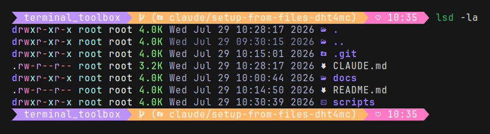

4. **bat / fzf / zoxide.** `cat` resolves to `bat` in your chosen theme,
   `Ctrl+R`/tab completion get fzf's fuzzy picker (same palette via
   `FZF_DEFAULT_OPTS`, wired in through Oh My Zsh's own `fzf` plugin so it
   finds the right integration files regardless of platform), and
   `z <partial-name>` jumps to a frecently-used directory via zoxide.

5. **tmux.** Start a session with `tmux` — the status bar comes up themed
   immediately, no `prefix + I` plugin-manager step needed. Dracula uses the
   official [dracula/tmux](https://github.com/dracula/tmux) plugin (cloned
   in directly by the script); the other 6 themes use a compact hand-colored
   status bar built from that theme's own palette, since not every theme has
   a maintained standalone (non-TPM) tmux port:

   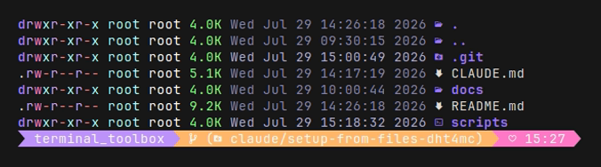

6. **Superfile.** Launch the TUI file manager with `spf` — it opens with
   your chosen theme already set in its `config.toml`:

   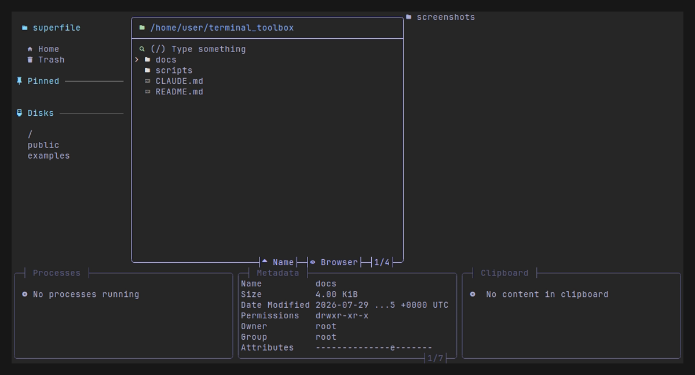

7. **Re-running is safe.** Every step is guarded by an existence check
   (directory, binary, or config line), so re-running after a failed step,
   or to pick up a new version of the script, only does the work that's
   still missing.

See `CLAUDE.md` for implementation notes and known platform quirks.

## Changelog

### 2026-07-29
**Oh My Zsh / shell setup**
- Enabled `zsh-autosuggestions` and `zsh-syntax-highlighting`; disabled Oh
  My Zsh's own theme (Oh My Posh draws the prompt).
- **Fixed:** on a machine with an existing `.zshrc`, Oh My Zsh's installer
  leaves it untouched and never sources `oh-my-zsh.sh`, silently no-op'ing
  the plugin patches. Both scripts now bootstrap Oh My Zsh into an
  existing `.zshrc` themselves.

**Reliability fixes** (found by dogfooding each script end-to-end)
- Superfile's `spf path-list` stopped initializing config as of v1.6.0 —
  switched to `spf --fix-config-file` (later replaced again, see below).
- `setup-windows.ps1`'s profile step silently did nothing on a fresh
  machine (`Get-Content -Raw` on a new `$PROFILE` returns `$null`, and
  `$null -notmatch <pattern>` is a falsy empty array).
- `setup-termux.sh`'s Superfile install was 100% broken (release tarball
  nests the binary one level deeper than assumed), and its oh-my-posh
  Android fallback 404'd on a nonexistent `posh-android-arm64` asset —
  oh-my-posh ships exactly one Android build, `posh-android-arm`.
- Unauthenticated `api.github.com` lookups (Superfile/lsd release checks)
  and piped installer scripts (`curl | bash`) had no error handling — a
  rate limit, network hiccup, or failed fetch would silently kill the rest
  of the script under `set -e`, or in the piped-install case risk
  executing a proxy's rejection body as shell commands. Both now check
  explicitly before proceeding.

**Tooling and theme system**
- Added bat, fzf, zoxide, and tmux (Linux/Termux only) to all three
  scripts, plus an interactive Nerd Font + theme picker (piped/CI runs
  keep the JetBrainsMono + Dracula defaults) with a strip-and-reappend
  mechanism so re-running replaces the managed config instead of
  duplicating it.
- **Fixed a real lsd bug:** Debian/Ubuntu's apt-packaged lsd (1.0.0) only
  honors numeric xterm-256 color indices — it silently ignores the hex
  format both `dracula/lsd` and `catppuccin/lsd` publish upstream. Fixed
  by generating real `colors.yaml` files with precomputed nearest-match
  numeric values for every theme except Dracula (already numeric).
- The theme roster went through two correction passes: oh-my-posh's
  per-flavor Catppuccin files all render as flat plain text with no color
  segments, so the pick moved to `catppuccin.omp.json` (the one file that
  actually uses powerline/diamond segments, hardcoding the Macchiato
  palette); and Gruvbox/Nord/Tokyo Night/Rose Pine/Everforest came back
  looking muddy and too similar to each other (those palettes are
  muted/pastel by design, and oh-my-posh has no official Nord/Rose
  Pine/Everforest theme at all), so all 5 were replaced with genuine
  vibrant premade themes instead. 10 themes → 7.
- Discovered Superfile supports fully custom theme files, not just its
  bundled names — every theme gets its own generated
  `~/.config/superfile/theme/<theme>.toml` from its own role colors.
- Replaced placeholder screenshots with real [VHS](https://github.com/charmbracelet/vhs)
  captures throughout, and added one-line curl-install commands to
  [Usage](#usage).
- **Fixed (real Windows run):** `setup-windows.ps1` only set the
  Process-scope execution policy, which doesn't persist — every new
  PowerShell window still refused to load `$PROFILE`. Now also sets
  `RemoteSigned` at `CurrentUser` scope.
- **Fixed (same run):** `spf --fix-config-file` opens the real controlling
  terminal directly, so on any actual interactive run it launched the full
  Superfile TUI and hung instead of writing the config. Fixed by writing a
  minimal `config.toml` ourselves instead of ever calling that flag.
- **Fixed (real device, oh-my-posh broke after a Termux backup restore):**
  `setup-termux.sh` only checked that `oh-my-posh` was on PATH, not that it
  actually ran — a binary can be present but non-functional (e.g. a
  non-PIE ELF after restoring `$PREFIX` from a different Termux
  build/channel). Fixed by verifying `oh-my-posh --version` actually
  succeeds before treating it as installed, repairing or falling back to
  the GitHub binary otherwise.

### 2026-07-30
- **Fixed (same device, still broken after the fix above):** the
  broken-binary repair's `rm -f` deletes a dpkg-tracked file without
  telling dpkg, so a plain `pkg install -y oh-my-posh` saw "already the
  newest version" and redeployed nothing — the binary stayed missing
  forever. Fixed with `pkg install --reinstall -y`, which forces dpkg to
  redeploy regardless of the recorded version.
- **Fixed:** `apt update`/`pkg update` return nonzero if even one
  unrelated configured source is unreachable (a stale PPA, a dead
  mirror), which under `set -e` silently killed the rest of the script at
  step 1 of 10 even though the sources we actually need were fine. Both
  now tolerate that failure and continue.
- **Replaced the JanDeDobbeleer theme slot with Atomic:** reference
  screenshots of a liked prompt (pill/capsule segments, gap instead of a
  powerline chevron between blocks) didn't match what upstream
  `jandedobbeleer.omp.json` currently ships — a diamond session/path/git
  layout with none of that styling. Rendered several candidate upstream
  themes for real (`ttyd` + Playwright) and compared against the
  reference; `atomic.omp.json` matched pixel-for-pixel.
- **Rebuilt the whole theme roster to an explicit 8-theme list:** Dracula,
  M365Princess, Atomic, Catppuccin, Catppuccin Mocha, JanDeDobbeleer,
  Marcduiker, Neko — dropping Paradox/Aliens/Montys/Unicorn. Every theme
  is fetched unmodified straight from upstream, including Catppuccin
  Mocha and Neko, which are genuinely flat/plain-style with no pill
  segments — that's how they look upstream, so they're used as-is rather
  than "fixed" the way the general Catppuccin pick was. Role colors were
  read from each theme's own palette (including inline hex in template
  strings, not just background/foreground fields) and cross-checked
  against the real fetched JSON, with invented values only where a role
  has no equivalent in that theme at all. Screenshots regenerated for all
  8 the same way as the Atomic swap.

### 2026-07-31
- **Added [nerdfetch](https://github.com/ThatOneCalculator/NerdFetch)** (a
  Nerd Font system-info fetch tool) to `setup-ubuntu.sh` and
  `setup-termux.sh`, invoked automatically at the end of a new shell.
  Windows is skipped entirely — nerdfetch's own project explicitly doesn't
  support it, even under Git Bash — matching the existing tmux/zsh
  "use WSL" carve-out in `setup-windows.ps1`. There's no distro package for
  Debian/Ubuntu/Termux, so it's a straight, architecture-independent fetch
  of the single POSIX shell script. Idempotency comes from the existing
  managed `.zshrc` block (regenerated in full each run), plus an explicit
  strip of any bare `nerdfetch` invocation line left outside that block.
- **Fixed (found while testing the above):** every tool installed to
  `~/.local/bin` (oh-my-posh, Superfile, and now nerdfetch) was never
  actually detected as already-installed on a rerun of `setup-ubuntu.sh` —
  the script's own process never had `~/.local/bin` on `PATH` itself, only
  the *generated* `.zshrc` did, so `command -v <tool>` only succeeded by
  accident (inherited from whatever the caller's shell already had). On a
  truly fresh account, every rerun would silently re-download instead of
  skipping. Fixed by exporting `PATH` for the script's own process too.
  Reproduced with a minimal, non-inherited `PATH` in the test harness and
  confirmed fixed by checking the installed file's mtime doesn't change
  and "already installed, skipping" prints correctly across reruns.
- **Added [fastfetch](https://github.com/fastfetch-cli/fastfetch) to
  `setup-windows.ps1`** as the Windows equivalent of nerdfetch (which
  doesn't support Windows at all), via its real winget package
  (`Fastfetch-cli.Fastfetch`), invoked at the end of `$PROFILE` the same
  way nerdfetch is invoked at the end of `.zshrc`.
- **All three scripts now comment out (never delete) a pre-existing
  fastfetch/neofetch invocation** they find in the shell config, so it
  doesn't print its own system-info banner alongside the new one on every
  prompt. A bare invocation of the tool the script itself just installed
  (nerdfetch on Linux/Termux, fastfetch on Windows) is still fully
  stripped and regenerated as before — only a genuinely pre-existing
  *other* tool's line gets the preserve-but-disable treatment. Verified
  end-to-end on all three scripts: a pre-seeded `neofetch`/`fastfetch`
  line gets commented out on the first run and stays that way (not
  re-commented, not duplicated) across reruns with a different theme.

### 2026-08-01
- **Added `scripts/setup-cachyos.sh`** for CachyOS (Arch Linux-based) —
  the same zsh/Oh My Zsh/Oh My Posh/lsd/bat/fzf/zoxide/tmux/Superfile/
  nerdfetch stack and 8-theme picker as `setup-ubuntu.sh`, adapted for
  `pacman`. Base packages and per-tool installs use a real `pacman -Syu`
  (never a bare `-Sy` — Arch doesn't support partial upgrades) with
  `--needed --noconfirm`, tolerating one unreachable repo the same way the
  apt/pkg fix does. Nerd Fonts skip the manual download-and-unzip dance
  Ubuntu/Termux need entirely — Arch's official `extra` repo packages
  every one of the 10 font choices directly as `ttf-<name>-nerd`. oh-my-posh,
  Superfile, and nerdfetch all reuse the exact same official installers
  (or direct fetch, for nerdfetch) the other scripts already use rather
  than reaching for AUR/`paru`, since none of the three have an official
  Arch package and this repo otherwise never needs an AUR helper. Verified
  with a PTY harness mocking `pacman` across two font/theme combinations,
  confirming the expected `pacman` calls and full idempotency on rerun.
- **Fixed (found via a real CachyOS run):** the CachyOS one-liner in this
  README used bash's `bash <(curl ...)` process-substitution form, but
  CachyOS defaults to fish, which doesn't understand `<(...)` at all —
  it fails immediately with "Invalid redirection target" before `curl`
  ever runs. Reproduced the exact error locally (installed real fish,
  same error message and caret position) and confirmed fish's own
  process-substitution equivalent, `psub`, fixes it:
  `bash (curl -fsSL <url> | psub)`. The README now shows the fish form
  first for this platform, with the bash/zsh form underneath for anyone
  who already switched shells.
- **Fixed (found via the same real CachyOS run):** `pacman` fails
  immediately with "unable to lock database" if another pacman/paru
  transaction is already running elsewhere on the system (in this case a
  genuinely concurrent update) — every package-install step in
  `setup-cachyos.sh` except the first one had no error handling at all for
  this, so `set -e` killed the whole script partway through on the very
  first lock contention it hit. Added a `pacman_run` helper that retries
  a few times with a short, increasing wait before giving up (this kind of
  lock contention is normally transient) and, only after several failed
  attempts, prints a clear message pointing at the stale-lock file to
  check/remove if nothing else is actually running. Verified with a mock
  `pacman` that fails a controlled number of times before succeeding (both
  the eventually-succeeds and the gives-up-after-5-attempts paths), and a
  full script run where every install step hits one transient failure.
- **Fixed (found via a real CachyOS run):** after a successful
  `setup-cachyos.sh` run, opening a new shell reported
  `[oh-my-zsh] plugin 'zsh-autosuggestions' not found` (and the same for
  `zsh-syntax-highlighting`), even though both were genuinely cloned into
  `~/.oh-my-zsh/custom/plugins/`. CachyOS ships a system-wide Oh My Zsh
  install and exports `$ZSH_CUSTOM` globally (pointing at that shared
  location) — that inherited env var wins over Oh My Zsh's own
  `${ZSH_CUSTOM:-$ZSH/custom}` fallback regardless of what `$ZSH` itself
  is set to, so the plugins we cloned went silently unfound. All three
  scripts now explicitly `export ZSH_CUSTOM` in `.zshrc`, forcing it back
  to where the plugins actually are. Reproduced by exporting `ZSH_CUSTOM`
  to a bogus path and starting a real zsh session (got the exact same
  "not found" errors), then confirmed the fix resolves it under the same
  simulated override, with idempotency verified across reruns.
- **Fixed (found via a real CachyOS run, reported as "that doesn't fix it
  entirely" after the `ZSH_CUSTOM` fix above):** a live Powerlevel10k
  instant-prompt error (`prompt_cr must be unset`) plus the shell's own
  banner rendering twice. Root cause: CachyOS's own default `~/.zshrc`
  (shipped by the `cachyos-zsh-config` package — confirmed by fetching it
  from `CachyOS/cachyos-zsh-config` upstream) ships Powerlevel10k, wired in
  via an instant-prompt guard block at the very top of the file plus
  `source /usr/share/zsh-theme-powerlevel10k/powerlevel10k.zsh-theme` and
  `source ~/.p10k.zsh` further down — none of which our script touched
  before, since it only manages its own marked block and appends after.
  P10k and oh-my-posh both hook zsh's own prompt-drawing internals, and
  having both active at once is exactly what produces P10k's own
  "prompt_cr must be unset" error. All three scripts now give P10k's
  instant-prompt block and theme/config source lines the same
  comment-don't-delete treatment as the existing fastfetch/neofetch
  handling — disabled, not removed, so the user can restore it by hand.
  The instant-prompt block's closing `fi` is matched as either `fi` or
  `# fi` so a rerun's `sed` range still finds the (now-commented) end of
  the block instead of running off the end of the file. Verified against
  the real upstream `cachyos-zsh-config` file: instant-prompt block, theme
  source, and `~/.p10k.zsh` source all get commented out on the first run,
  everything else in the file (oh-my-zsh sourcing, aliases, other plugin
  sources) is untouched, and a second run makes no further changes.
  `setup-cachyos.sh` additionally now checks (read-only — it never edits
  these) whether `/etc/zsh/{zshrc,zshenv,zprofile,zlogin}` reference P10k
  or fastfetch, and prints a warning pointing at the specific file(s) if
  so, since those are shared system-wide config rather than the user's own
  dotfile and editing them automatically would affect every account on the
  machine, not just the one running this script.
